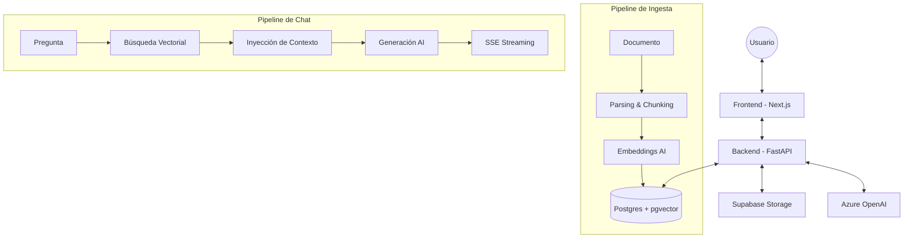

# ✦ RAG Assistants

Plataforma premium de **Retrieval-Augmented Generation (RAG)** que permite crear asistentes personalizados, alimentar su base de conocimientos con documentos propios y chatear con ellos en tiempo real utilizando IA avanzada.


---

## 📖 Descripción del Producto

**RAG Assistants** resuelve el problema de la sobrecarga de información y la falta de contexto en los modelos de lenguaje genéricos. Permite a usuarios y empresas crear "expertos" digitales que responden basándose exclusivamente en sus propios documentos (PDF, DOCX, etc.), garantizando respuestas precisas, citadas y libres de alucinaciones.

**¿Qué hace?**
- Permite crear múltiples asistentes con personalidades y conocimientos únicos.
- Procesa y vectoriza documentos para búsqueda semántica.
- Proporciona una interfaz de chat fluida con streaming y gestión de fuentes.
- Ofrece un dashboard de analíticas para monitorizar el uso y feedback.

---

## 🛠️ Stack Tecnológico

- **Frontend**: Next.js 14 (App Router), TypeScript, Vanilla CSS Modules.
- **Backend**: FastAPI (Python 3.11+), Pydantic v2.
- **IA**: Azure OpenAI (GPT-4o-mini para chat, text-embedding-3-small para vectores).
- **Base de Datos**: Supabase (PostgreSQL + pgvector).
- **Almacenamiento**: Supabase Storage.
- **Logging**: Loguru para trazabilidad estructurada.

---

## 🏗️ Arquitectura del Sistema

El sistema sigue una arquitectura de RAG clásico con una capa de servicios desacoplada:



---

## 🎨 Decisiones de Diseño

### Técnicas
- **FastAPI + SSE**: Se eligió Server-Sent Events en lugar de WebSockets para el streaming de respuestas por su simplicidad, menor sobrecarga de red y reconexión automática nativa en el navegador.
- **pgvector**: Almacenar los vectores directamente en la base de datos relacional (Supabase) permite realizar filtros complejos (como el aislamiento por `assistant_id`) de forma atómica y eficiente sin necesidad de un Vector DB externo.
- **Chunking Recursivo**: Se implementó `RecursiveCharacterTextSplitter` para asegurar que los fragmentos de texto mantengan coherencia semántica, evitando cortes abruptos en medio de oraciones.

### Producto / UX
- **Estética HUD (Heads-Up Display)**: Se optó por una interfaz inmersiva y oscura para reducir la fatiga visual y dar una sensación de herramienta avanzada y técnica.
- **Dynamic Island Navigation**: Una navegación flotante que se adapta al contexto, maximizando el espacio de lectura para los documentos y el chat.
- **Citas Integradas**: En lugar de mostrar fuentes al final, se permite inspeccionar exactamente qué fragmento de qué documento generó la respuesta para generar confianza en el usuario.

---

## 🚀 Guía de Ejecución Local

### Requisitos Previos
- Python 3.11+
- Node.js 18+
- Cuenta de Supabase y Azure OpenAI

### 1. Configuración del Entorno
Crea un archivo `.env` en la raíz del proyecto (basado en `.env.example`):
```env
AZURE_OPENAI_API_KEY=...
AZURE_OPENAI_ENDPOINT=...
SUPABASE_URL=...
SUPABASE_SERVICE_KEY=...
```

### 2. Backend (FastAPI)
```bash
# Crear y activar entorno virtual
python -m venv venv
source venv/bin/activate  # En Windows: venv\Scripts\activate

# Instalar dependencias
pip install -r requirements.txt

# Iniciar servidor
uvicorn backend.main:app --reload --port 8000
```

### 3. Frontend (Next.js)
```bash
cd frontend
npm install
npm run dev
```
La aplicación estará disponible en `http://localhost:3000`.

---

## 🛡️ Cumplimiento del Core (RAG & Lógica)

### 1. Aislamiento por Asistente en el Retrieval
El aislamiento se garantiza a nivel de base de datos mediante filtros estrictos en las consultas SQL/RPC. Cada fragmento (`chunk`) en la tabla `chunks` tiene una relación con un `assistant_id`. Cuando un usuario pregunta a un asistente específico, la función de búsqueda vectorial `match_chunks` incluye un filtro obligatorio:
```sql
WHERE chunks.assistant_id = assistant_id_filter
```
Esto asegura que, aunque haya millones de documentos, un asistente jamás tendrá acceso al contexto de otro.

### 2. Implementación de Persistencia y Memoria
- **Persistencia**: Todas las conversaciones y mensajes se guardan en las tablas `conversations` y `messages` de Supabase.
- **Memoria de Corto Plazo**: En cada interacción, el backend recupera los últimos 10 mensajes de la conversación (`history`) y los inyecta en el prompt enviado a la IA, permitiendo el seguimiento de hilos conversacionales y referencias a mensajes anteriores.

### 3. Gestión de Citas y "No Inventar"
- **Citas**: Cada respuesta de la IA se guarda junto con un array de `sources` (metadatos de los fragmentos recuperados). El frontend utiliza estos metadatos para mostrar exactamente qué documentos se consultaron.
- **No Inventar (Grounding)**: Se implementa mediante **Prompt Engineering Estricto**. El `system_prompt` de cada asistente incluye instrucciones imperativas: *"Responde SOLO usando la información de los documentos proporcionados. Si la respuesta no está en el contexto, di: 'No encuentro esa información' y no intentes adivinar"*.

---
